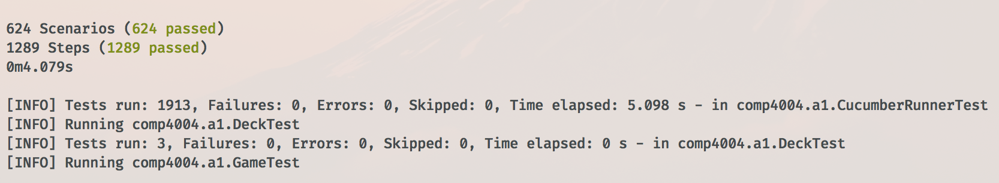

## Software Quality Assurance - Poker Game

- *Class*: COMP4004
- *Author*: Matthew Fors

[Link to Repository](https://github.com/enforser/comp4004/tree/master/pokerGame)

### Important for Assignment Two

Refer to the bottom of this file for information on the work done for assignment two, including images of some tests run. 

### Correction Grid

In this directory: `ForsMatthew-A2-CorrectionGrid.xlsx`

### How to run

This application may work with different versions, but to develop and test I used: 

- *java*: `1.8.0_111`
- *maven*: `3.3.9`

Step #1: Clone the directory and navigate into assignment-one directory. 

```
git clone https://github.com/enforser/comp4004.git
cd comp4004/pokerGame
```

Step #2: Install mvn dependencies and build executable jar file

```
mvn clean install
```

Step #3: Run the jar file

```
java -jar target/pokerGame-1.0-SNAPSHOT.jar /Path/To/Cards.txt
```

### Configuring the Cards input file

When running the app you must provide a file which represents the initial hands of both the AI and user players. 
An example structure of this file is as follows: 

```
C3 C5 C10 D3 HA SJ SK SQ SA S10
```

The first 5 cards represent the hand of the AI, while the final 5 represent the hand of the User. 

Any exchanged cards are drawn from a deck that includes all 52 cards minus those which are in either the AI or User hands.

Each card is represented by the first letter of their suit (clubs => C, diamonds => D, spades => S, hearts => H). 
Following the suit is the "rank" of the card, which can be from the set of *{ 2, 3, 4, 5, 6, 7, 8, 9, 10, J, Q, K, A }*.

**Any deviation from this structure has potential to cause unknown errors.** 

### Running the tests

Provided you are in the `pokerGame` directory, and have already installed dependencies then simply run `mvn test`. 

To execute only the cucumber tests you can call: `mvn -Dtest=comp4004.a1.CucumberRunnerTest test`

Note that the text files used by the tests live inside the `src/main/resources` directory. 
The file which provides a majority of the tests with hands is `src/main/resources/testInputFile.txt`. 
This file contains all of the hands which are used for acceptance testing, and the other files we're used for specific
use cases in the TDD unit tests.

### Guide to the Cucumber Tests

#### Feature Files

Feature files can be found from the pokerGame directory in the `src/test/resources/cucumber` directory. 

#### Step Files

Relevant steps used by the cucumber tests can be found in `src/test/java/COMP4004.a1/steps`

#### Images to prove that tests run

Since there are 1900+ tests, I am not including a picture of each test. Instead, I am including an image of proof that at least some tests 
for each feature file are run. 

##### Results




##### AIPholds.feature

Ensures that the AIP holds it's hand when applying the improvement strategy, if it has 
a straight or better. 


##### aipstrategy.feature

These tests use example tables to ensure that AIP will properly implement the 
improvement strategy, then lose or win based off which cards it ends up with, 
given the available cards in 'deck'. 
This allows tests to be written for specific game situations. Note that in real 
usage of the application the deck will always contain all cards except those which
have been discarded or are in a hand. Doing the deck this way is simply a way 
to fake game situations to better test how AIP will react when presented certain
cards from the deck. 
The first set of Scenarios represents moves that AIP makes to win the game. 
The second set represents the same moves but with different cards being given
to AIP, such that it loses. 


##### anyOrder.feature

These tests use an example table to test each permutation of a hand. 
Most hand types are only tested with one particular instance of the hand.
For example, we test S10, SJ, SQ, SK, and SA for royal flush - but 
it is tested in all 120 possible permutations. 
There are up to 120 permutations for hands with distinct cards and less 
for hands which have repeated ranks. 
To generate permutations I used: 
https://www.dcode.fr/permutations-generator


##### handPriorities.feature

These tests verify that two hands of different values will be properly 
compared against each other. Note that it does only covers different hands.
By this I mean that this feature file does not encompass comparisons between 
the same hand types (ex. royal flush vs. royal flush). 
The tests here involve testing the various possible types of hands against each other.
For each comparison made the tests will ensure that the winner of the game is that
with the better hand - regardless of if it belongs to AIP or HTB. 


##### sameHandCompare.feature

This file contains the tests which determine how a hands which are the same value 
are compared against each other. For example, we don't test if a royal flush beats
a straight flush - instead we test how a royal flush beats (or loses) against other 
royal flushes! 


